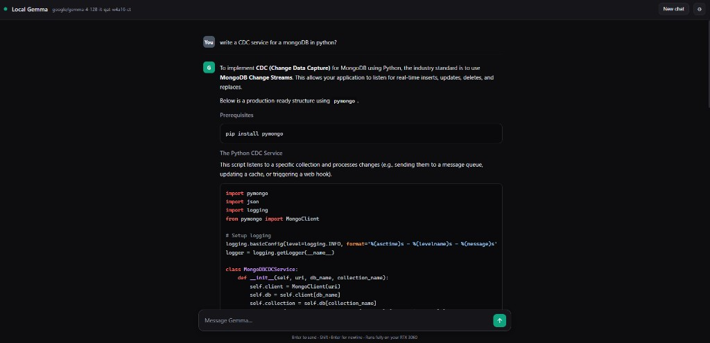
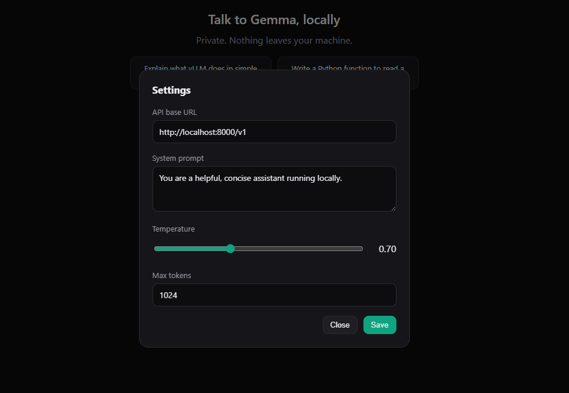

# Local Gemma (vLLM)

Run Google **Gemma 4** locally with **vLLM** on your own GPU — a private,
OpenAI-compatible LLM server defined in a single Docker Compose file. Nothing leaves your machine.

> **What this repo is:** primarily the **local deployment** — the `docker-compose.yml` and the
> setup steps to get Gemma 4 serving on your GPU. Because vLLM exposes a standard
> **OpenAI-compatible API**, you can point any compatible tool or your own code at it.
>
> **The chat UI is an optional helper.** `chat.html` is a single-file web client included for
> convenience (quick testing and everyday chatting). It is not required — the server is the core.



---

## How it works

```
Browser (chat.html)
      |
      |  HTTP  POST /v1/chat/completions  (streaming)
      v
vLLM Docker container  (OpenAI-compatible API on localhost:8000)
      |
      v
Gemma 4 model loaded on your GPU
```

- The UI is a **single static file** (`chat.html`) — no build step, no backend, no dependencies
  except an optional CDN for syntax highlighting.
- vLLM exposes a standard **OpenAI-compatible** API, so the page just speaks that protocol.
- Conversation history lives in the browser tab; vLLM itself is stateless between requests.

---

## Project files

| File | Purpose |
|------|---------|
| `docker-compose.yml` | Defines the vLLM service, GPU access, model, and cached weights volume. |
| `chat.html` | The full chat UI (open it in any browser). |
| `.env.example` | Template for your Hugging Face token. Copy to `.env`. |
| `.env` | Your real token. **Git-ignored — never commit it.** |
| `.gitignore` | Keeps `.env` and editor noise out of version control. |

---

## Requirements

- **Docker** with GPU support:
  - Windows 11: Docker Desktop + WSL2 + NVIDIA driver.
  - Linux: Docker + NVIDIA Container Toolkit.
- An **NVIDIA GPU**. ~12 GB VRAM runs the 12B QAT model; smaller cards can use the E4B fallback.
- A **Hugging Face account**, the **Gemma license accepted**, and an **access token**.
- ~25–40 GB free disk for the Docker image and model cache.

---

## Setup & run

### 1. Get a Hugging Face token
1. Accept the license on the model page:
   <https://huggingface.co/google/gemma-4-12B-it-qat-w4a16-ct>
2. Create a token (Read scope is enough): <https://huggingface.co/settings/tokens>

### 2. Configure the token
```bash
cp .env.example .env
```
Then edit `.env` and set your token:
```
HF_TOKEN=hf_your_token_here
```

### 3. (Windows/WSL only) Give WSL enough memory
Loading the ~9.5 GB checkpoint needs RAM headroom. Create `C:\Users\<you>\.wslconfig`:
```ini
[wsl2]
memory=24GB
swap=8GB
```
Then apply it:
```powershell
wsl --shutdown
```
Docker Desktop will restart its engine automatically.

### 4. Start the server
```bash
docker compose up -d
```
The **first run** pulls the vLLM image and downloads the model (can take several minutes).
Watch progress with:
```bash
docker compose logs -f
```
It is ready when you see `Application startup complete`.

### 5. Open the UI
Open `chat.html` in your browser (double-click it, or serve the folder). The status dot
turns **green** when it connects to vLLM.

### Stop / start
```bash
docker compose stop     # frees the GPU (e.g. before gaming)
docker compose start    # bring it back later
```

---

## Optional web chat UI (`chat.html`) & its features

> This is the bundled helper client. Skip it entirely if you only want the API.

### Chat basics
- Type in the box and press **Enter** to send. **Shift+Enter** inserts a newline.
- Responses **stream in token by token**.
- **New chat** (top bar) clears the conversation and frees the context window.
- The top bar shows a **status dot** (green = connected) and the **active model name**;
  it auto-reconnects every 15 seconds if the server is stopped/restarted.

### Markdown & code
- Renders **headings, bullet/numbered lists, bold, italic, and inline code**.
- Code blocks get **real syntax highlighting** (highlight.js). A block is colorized the
  moment it finishes streaming, so you can read completed code while the rest is still typing.

### Copy buttons
- **Per code block:** hover over any code block to reveal a **Copy** button (top-right) that
  copies just that code.
- **Per message:** a **Copy message** button under each answer copies the whole reply.

### Continue a cut-off answer
If a reply hits the length limit, an amber note appears:
> ⚠️ This answer was cut off because it reached the length limit.

…with a green **→ Continue answer** button that asks the model to keep going and appends
the continuation to the same message.

### RTL support
Each paragraph auto-detects its text direction, so right-to-left and left-to-right languages
render correctly — even when mixed in the same conversation. Code blocks always stay left-to-right.

### Settings
Open the gear icon (top-right). Settings are saved in your browser (localStorage).



| Setting | What it does |
|---------|--------------|
| **API base URL** | Where the UI sends requests. Default `http://localhost:8000/v1`. |
| **System prompt** | The hidden instruction that shapes the assistant's behavior. |
| **Temperature** | Higher = more creative/random, lower = more focused. Default `0.70`. |
| **Max tokens** | Maximum length of a single reply. Raise it for longer answers. |

---

## Understanding limits (why answers stop)

- **Context window** (`--max-model-len` in `docker-compose.yml`): total tokens for a request,
  counting the prompt **and** the generated answer combined.
- **Max tokens** (UI setting): caps the length of one reply.
- A reply that stops early reports `finish_reason: "length"` (cut off) vs `"stop"` (finished
  naturally). Use **Continue** for the former, and **New chat** to free a full context window.

---

## Troubleshooting

| Symptom | Likely cause | Fix |
|---------|--------------|-----|
| Status dot stays red / "offline" | vLLM not running | `docker compose start`, check `docker compose logs`. |
| `CUDA out of memory` on startup | Model + KV cache exceed VRAM | Keep `--enforce-eager`, lower `--max-model-len`, or use the E4B model. |
| Load stuck at `Loading ... 0%` (Windows) | Cache on slow `9P` mount / low RAM | Use the named Docker volume (already configured) + raise WSL memory. |
| `401` / gated model error | License not accepted or token missing | Accept the license and verify `HF_TOKEN` in `.env`. |
| Answer always cut off | Hit `max_tokens` | Raise **Max tokens** in Settings, or click **Continue**. |

---

## Security notes

- **Never commit `.env`** — it holds your token. It is already in `.gitignore`.
- Treat the model as untrusted: do not send secrets, credentials, or OTP codes.
- Everything runs locally; no data is sent to external services (the only optional external
  request is loading highlight.js from a CDN, which the browser caches).
